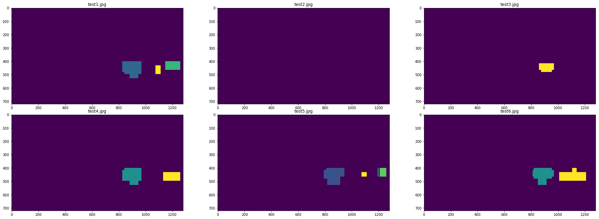

## Writeup Template
### You can use this file as a template for your writeup if you want to submit it as a markdown file, but feel free to use some other method and submit a pdf if you prefer.

---

**Vehicle Detection Project**

The goals / steps of this project are the following:

* Perform a Histogram of Oriented Gradients (HOG) feature extraction on a labeled training set of images and train a classifier Linear SVM classifier
* Optionally, you can also apply a color transform and append binned color features, as well as histograms of color, to your HOG feature vector. 
* Note: for those first two steps don't forget to normalize your features and randomize a selection for training and testing.
* Implement a sliding-window technique and use your trained classifier to search for vehicles in images.
* Run your pipeline on a video stream (start with the test_video.mp4 and later implement on full project_video.mp4) and create a heat map of recurring detections frame by frame to reject outliers and follow detected vehicles.
* Estimate a bounding box for vehicles detected.

## [Rubric](https://review.udacity.com/#!/rubrics/513/view) Points
### Here I will consider the rubric points individually and describe how I addressed each point in my implementation.  

---
### Writeup / README

#### 1. Provide a Writeup / README that includes all the rubric points and how you addressed each one.  You can submit your writeup as markdown or pdf.  [Here](https://github.com/udacity/CarND-Vehicle-Detection/blob/master/writeup_template.md) is a template writeup for this project you can use as a guide and a starting point.  

You're reading it!

### Histogram of Oriented Gradients (HOG)

#### 1. Explain how (and identify where in your code) you extracted HOG features from the training images.

The code for this step is contained in the first code cell of the IPython notebook. This code is from the lecutre practise.

I started by exploaring the `vehicle` and `non-vehicle` images.  

* Vehicle Image Shape: (64, 64, 3)  Total Number: 8792
* Non Vehicle Image Shape: (64, 64, 3)  Total Number: 8968

Here is an example of one of each of the `vehicle` and `non-vehicle` classes:

Here is an example using the grayscale color space and HOG parameters of `orientations=9`, `pixels_per_cell=(8, 8)` and `cells_per_block=(2, 2)`:

#### 2. Explain how you settled on your final choice of HOG parameters.

I tried various combinations of parameters and the ones suggested in the lecture practise works pretty well. In the image I can clearly see the high level shape of the car

#### 3. Describe how (and identify where in your code) you trained a classifier using your selected HOG features (and color features if you used them).

In code block 5, I defined a function to:
* Compute the histogram of the color channels separately
* Concatenate the channel histogram features
* Compute the spatial feature of 32*32 version of the image
* Concatenate spatial and histogram features

In code block 6, I defined a pipeline function `extract features()` to extract HOG, COLOR, and Spatial features.
I experimented with several color spaces on LinearSVM, I found the color feature in `LUV` color space works best. Here's the accuracy result of each color space:
RGB:0.92, HSV: 0.95, hls:0.95 LUV:0.96 YUV:0.92, 

Then I extract features and labels of all vehicles and non vehicle images.

I defined a SVC classfier. I used grid_search.GridSearchCV to tune the parameters. The best combination of C and kernel is 10 and rbf 

The final result of the prediction is 0.9938

### Sliding Window Search

#### 1. Describe how (and identify where in your code) you implemented a sliding window search.  How did you decide what scales to search and how much to overlap windows?

Since we will use the pipeline to process many images in a video, the pipeline only need to extract the hog feature once before sliding windows. The function I created is `sliding_window_search()`, it takes in an image and return an array of bboxes. The function takes these steps to find the cars:
* Get image of the area of intest
* Scale the image
* Get hog feature 
* Slide the window to get a patch
* Extract features for this patch
* Make prediction
* Scale the image properly to draw on original image
    
The window size is fixed, we need to scale the image, so that the box appears in different size when scaled back.
The larger the scale is, the bigger the box is. So I start from 1, becasue 64x64 boxes is pretty small. The larger car will be around 100x100 in the image, so the max scale can be 2. 

#### 2. Show some examples of test images to demonstrate how your pipeline is working.  What did you do to optimize the performance of your classifier?

Ultimately I searched the image with 3 different scales using Grayscale features plus spatially binned color and histograms of color in the feature vector, which provided a nice result.  Here are some example images:

---

### Video Implementation

#### 1. Provide a link to your final video output.  Your pipeline should perform reasonably well on the entire project video (somewhat wobbly or unstable bounding boxes are ok as long as you are identifying the vehicles most of the time with minimal false positives.)
Here's a [link to my video result](./output_videos/project_video.mp4)

#### 2. Describe how (and identify where in your code) you implemented some kind of filter for false positives and some method for combining overlapping bounding boxes.

I recorded the positions of positive detections in each frame of the video.  From the positive detections I created a heatmap and then thresholded that map to identify vehicle positions.  I then used `scipy.ndimage.measurements.label()` to identify individual blobs in the heatmap.  I then assumed each blob corresponded to a vehicle.  I constructed bounding boxes to cover the area of each blob detected.  

Here's an example result showing the heatmap from a series of frames of video, the result of `scipy.ndimage.measurements.label()` and the bounding boxes then overlaid on the last frame of video:

### Here are six frames and their corresponding heatmaps:

### Here is the output of `scipy.ndimage.measurements.label()` on the integrated heatmap from all six frames:

### Here the resulting bounding boxes are drawn onto all six frames:

---

### Discussion

#### 1. Briefly discuss any problems / issues you faced in your implementation of this project.  Where will your pipeline likely fail?  What could you do to make it more robust?
*Problem and Issues:*
* Processing time of each image was very long when I used ALL color channel for HOG, spatial, and color histogram features. Although the accuracy of the model is nearly 0.999, the trade off is too much. Only used one color channel in LUV color space

* To minimize the search area, instead of search the full area of interest with different scales, I used different scale on differnt area depends on the distance from the camera.

* The box size was jumping around, not stable. To better handle the boxes, I defined a car class that holds recent high confident detections, predict the new detection, igonore false detections, calculate the best box position, and make each frame more smooth.

*Possible failure:*
The current pipeline may not detect rapid position changes, for example, Hard brake, accident. The pipeline may consider it as false detection

*More robust:*

* Use multiple cameras
* Bird's eye view

